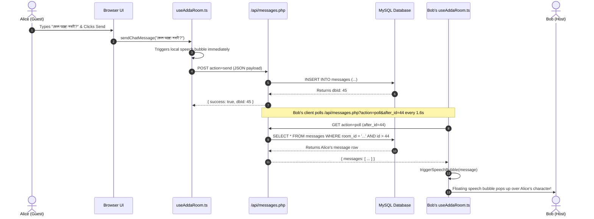
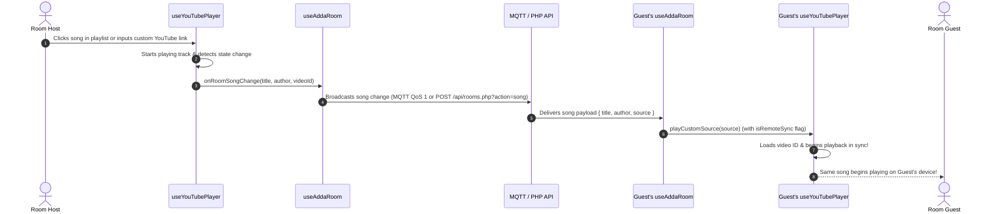

# Data Flow Architecture & Real-Time Sync

## 1. Chat Message & Speech Bubble Flow (PHP Mode)

```mermaid
sequenceDiagram
    autonumber
    actor Alice as Alice (Guest)
    participant UI as Browser UI
    participant Hook as useAddaRoom.ts
    participant API as /api/messages.php
    participant DB as MySQL Database
    participant BobHook as Bob's useAddaRoom.ts
    actor Bob as Bob (Host)

    Alice->>UI: Types "কেমন আছো সবাই?" & Clicks Send
    UI->>Hook: sendChatMessage("কেমন আছো সবাই?")
    Hook->>Hook: Triggers local speech bubble immediately
    Hook->>API: POST action=send (JSON payload)
    API->>DB: INSERT INTO messages (...)
    DB-->>API: Returns dbId: 45
    API-->>Hook: { success: true, dbId: 45 }

    Note over BobHook,API: Bob's client polls /api/messages.php?action=poll&after_id=44 every 1.6s
    BobHook->>API: GET action=poll (after_id=44)
    API->>DB: SELECT * FROM messages WHERE room_id = '...' AND id > 44
    DB-->>API: Returns Alice's message row
    API-->>BobHook: { messages: [ ... ] }
    BobHook->>BobHook: triggerSpeechBubble(message)
    BobHook->>Bob: Floating speech bubble pops up over Alice's character!
```

---

## 2. Synchronized Room Music Flow

```mermaid
sequenceDiagram
    autonumber
    actor Host as Room Host
    participant HostPlayer as useYouTubePlayer
    participant HostHook as useAddaRoom
    participant Transport as MQTT / PHP API
    participant GuestHook as Guest's useAddaRoom
    participant GuestPlayer as Guest's useYouTubePlayer
    actor Guest as Room Guest

    Host->>HostPlayer: Clicks song in playlist or inputs custom YouTube link
    HostPlayer->>HostPlayer: Starts playing track & detects state change
    HostPlayer->>HostHook: onRoomSongChange(title, author, videoId)
    HostHook->>Transport: Broadcasts song change (MQTT QoS 1 or POST /api/rooms.php?action=song)
    Transport->>GuestHook: Delivers song payload { title, author, source }
    GuestHook->>GuestPlayer: playCustomSource(source) (with isRemoteSync flag)
    GuestPlayer->>GuestPlayer: Loads video ID & begins playback in sync!
    GuestPlayer-->>Guest: Same song begins playing on Guest's device!
```

