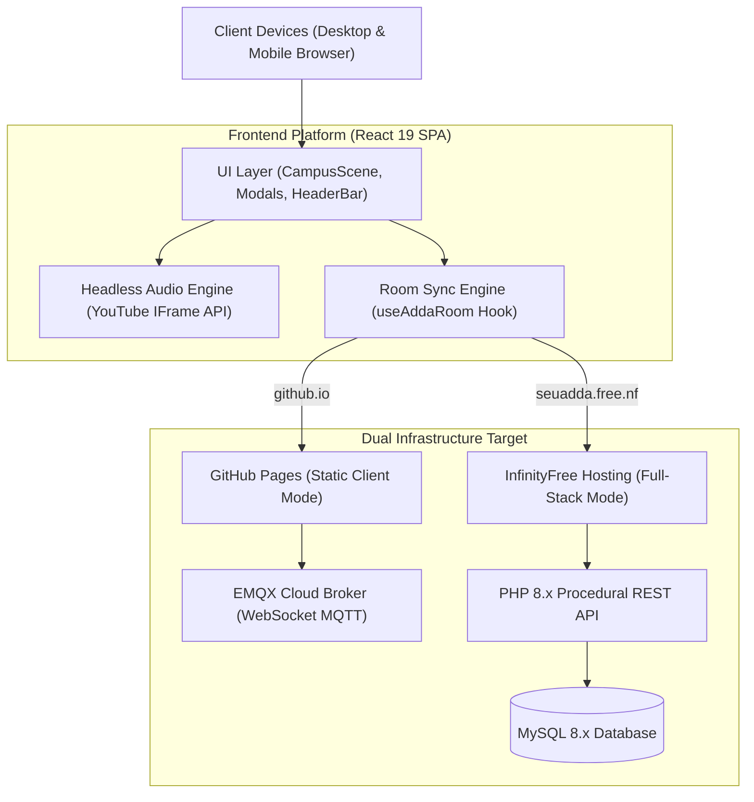
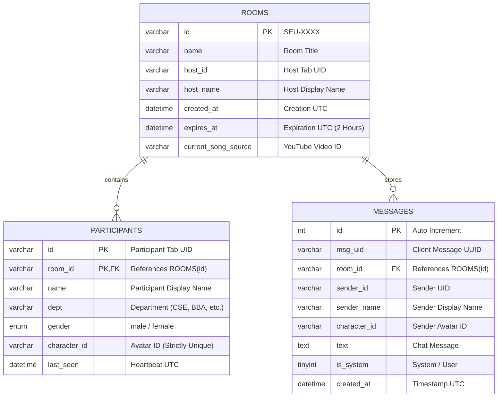

# System Architecture Diagrams & Visual Reference

## 1. High-Level Architecture Topology

```mermaid
flowchart TD
    UserClient["Client Devices (Desktop & Mobile Browser)"]
    
    subgraph FrontendPlatform["Frontend Platform (React 19 SPA)"]
        UI["UI Layer (CampusScene, Modals, HeaderBar)"]
        AudioEngine["Headless Audio Engine (YouTube IFrame API)"]
        RoomState["Room Sync Engine (useAddaRoom Hook)"]
    end

    subgraph DualBackend["Dual Infrastructure Target"]
        GH["GitHub Pages (Static Client Mode)"]
        EMQX["EMQX Cloud Broker (WebSocket MQTT)"]
        IF["InfinityFree Hosting (Full-Stack Mode)"]
        PHPAPI["PHP 8.x Procedural REST API"]
        MySQL[("MySQL 8.x Database")]
    end

    UserClient --> UI
    UI --> RoomState
    UI --> AudioEngine
    RoomState -->|"github.io"| GH
    GH --> EMQX
    RoomState -->|"seuadda.free.nf"| IF
    IF --> PHPAPI
    PHPAPI --> MySQL
```

---

## 2. Room State & Entity Relationship

```mermaid
erDiagram
    ROOMS ||--o{ PARTICIPANTS : contains
    ROOMS ||--o{ MESSAGES : stores
    
    ROOMS {
        varchar id PK "SEU-XXXX"
        varchar name "Room Title"
        varchar host_id "Host Tab UID"
        varchar host_name "Host Display Name"
        datetime created_at "Creation UTC"
        datetime expires_at "Expiration UTC (2 Hours)"
        varchar current_song_source "YouTube Video ID"
    }

    PARTICIPANTS {
        varchar id PK "Participant Tab UID"
        varchar room_id PK,FK "References ROOMS(id)"
        varchar name "Participant Display Name"
        varchar dept "Department (CSE, BBA, etc.)"
        enum gender "male / female"
        varchar character_id "Avatar ID (Strictly Unique)"
        datetime last_seen "Heartbeat UTC"
    }

    MESSAGES {
        int id PK "Auto Increment"
        varchar msg_uid "Client Message UUID"
        varchar room_id FK "References ROOMS(id)"
        varchar sender_id "Sender UID"
        varchar sender_name "Sender Display Name"
        varchar character_id "Sender Avatar ID"
        text text "Chat Message"
        tinyint is_system "System / User"
        datetime created_at "Timestamp UTC"
    }
```

