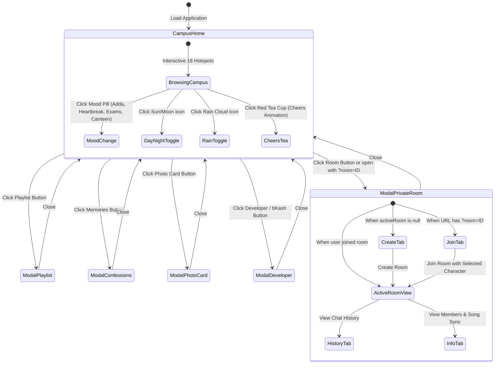

# Page, Screen & Modal Map

```mermaid
stateDiagram-v2
    [*] --> CampusHome: Load Application
    
    state CampusHome {
        [*] --> BrowsingCampus: Interactive 18 Hotspots
        BrowsingCampus --> MoodChange: Click Mood Pill (Adda, Heartbreak, Exams, Canteen)
        BrowsingCampus --> DayNightToggle: Click Sun/Moon Icon
        BrowsingCampus --> RainToggle: Click Rain Cloud Icon
        BrowsingCampus --> CheersTea: Click Red Tea Cup (Cheers Animation)
    }

    CampusHome --> ModalPlaylist: Click Playlist Button
    CampusHome --> ModalConfessions: Click Memories Button
    CampusHome --> ModalPhotoCard: Click Photo Card Button
    CampusHome --> ModalDeveloper: Click Developer / bKash Button
    CampusHome --> ModalPrivateRoom: Click Room Button or open with ?room=ID

    state ModalPrivateRoom {
        [*] --> CreateTab: When activeRoom is null
        [*] --> JoinTab: When URL has ?room=ID
        [*] --> ActiveRoomView: When user joined room
        CreateTab --> ActiveRoomView: Create Room
        JoinTab --> ActiveRoomView: Join Room with Selected Character
        ActiveRoomView --> HistoryTab: View Chat History
        ActiveRoomView --> InfoTab: View Members & Song Sync
    }

    ModalPlaylist --> CampusHome: Close
    ModalConfessions --> CampusHome: Close
    ModalPhotoCard --> CampusHome: Close
    ModalDeveloper --> CampusHome: Close
    ModalPrivateRoom --> CampusHome: Close
```

