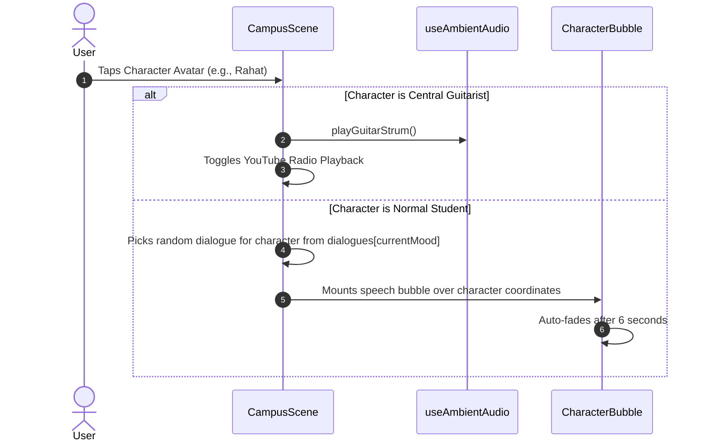
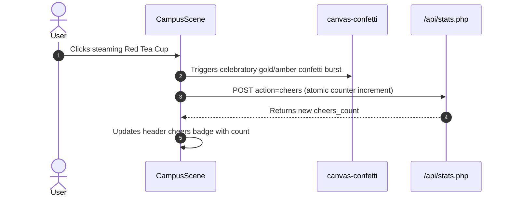

# User Interaction Flows & Behavioral Sequences

## 1. Campus Character Tap Flow

```mermaid
sequenceDiagram
    autonumber
    actor User
    participant Scene as CampusScene
    participant Audio as useAmbientAudio
    participant Bubble as CharacterBubble

    User->>Scene: Taps Character Avatar (e.g., Rahat)
    alt Character is Central Guitarist
        Scene->>Audio: playGuitarStrum()
        Scene->>Scene: Toggles YouTube Radio Playback
    else Character is Normal Student
        Scene->>Scene: Picks random dialogue for character from dialogues[currentMood]
        Scene->>Bubble: Mounts speech bubble over character coordinates
        Bubble->>Bubble: Auto-fades after 6 seconds
    end
```

## 2. Red Tea Cheers Flow

```mermaid
sequenceDiagram
    autonumber
    actor User
    participant Scene as CampusScene
    participant Confetti as canvas-confetti
    participant Stats as /api/stats.php

    User->>Scene: Clicks steaming Red Tea Cup
    Scene->>Confetti: Triggers celebratory gold/amber confetti burst
    Scene->>Stats: POST action=cheers (atomic counter increment)
    Stats-->>Scene: Returns new cheers_count
    Scene->>Scene: Updates header cheers badge with count
```

