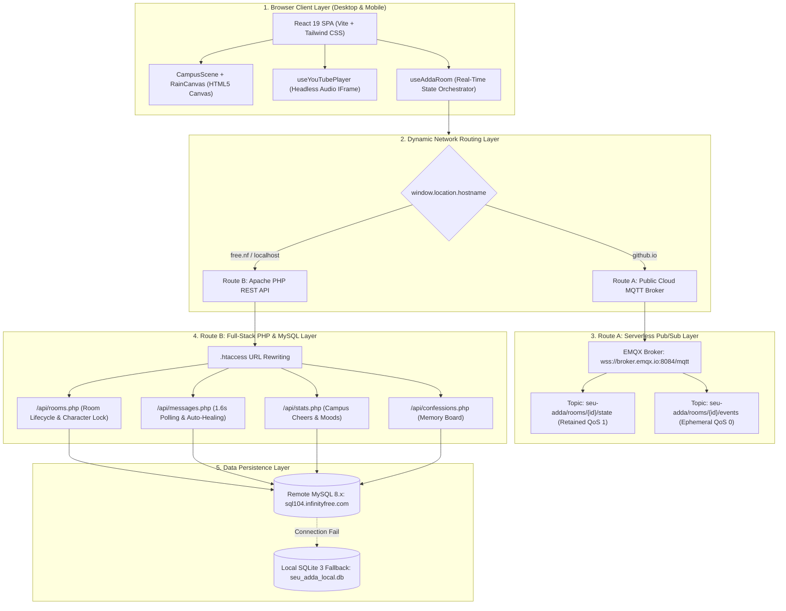

# Comprehensive Architecture Diagrams Collection

## 1. Dual-Deployment Multi-Layer Architecture

```mermaid
flowchart TB
    subgraph ClientLayer["1. Browser Client Layer (Desktop & Mobile)"]
        ReactApp["React 19 SPA (Vite + Tailwind CSS)"]
        SceneCanvas["CampusScene + RainCanvas (HTML5 Canvas)"]
        PlayerEngine["useYouTubePlayer (Headless Audio IFrame)"]
        RoomHook["useAddaRoom (Real-Time State Orchestrator)"]
    end

    subgraph NetworkRouting["2. Dynamic Network Routing Layer"]
        HostDetector{"window.location.hostname"}
        HostDetector -->|"github.io"| RouteMQTT["Route A: Public Cloud MQTT Broker"]
        HostDetector -->|"free.nf / localhost"| RoutePHP["Route B: Apache PHP REST API"]
    end

    subgraph CloudMQTT["3. Route A: Serverless Pub/Sub Layer"]
        EMQX["EMQX Broker: wss://broker.emqx.io:8084/mqtt"]
        RetainedState["Topic: seu-adda/rooms/{id}/state (Retained QoS 1)"]
        LiveEvents["Topic: seu-adda/rooms/{id}/events (Ephemeral QoS 0)"]
    end

    subgraph DynamicPHP["4. Route B: Full-Stack PHP & MySQL Layer"]
        ApacheMod[".htaccess URL Rewriting"]
        RoomsPHP["/api/rooms.php (Room Lifecycle & Character Lock)"]
        MessagesPHP["/api/messages.php (1.6s Polling & Auto-Healing)"]
        StatsPHP["/api/stats.php (Campus Cheers & Moods)"]
        ConfessionsPHP["/api/confessions.php (Memory Board)"]
    end

    subgraph DataStorage["5. Data Persistence Layer"]
        RemoteMySQL[("Remote MySQL 8.x: sql104.infinityfree.com")]
        LocalSQLite[("Local SQLite 3 Fallback: seu_adda_local.db")]
    end

    ReactApp --> SceneCanvas
    ReactApp --> PlayerEngine
    ReactApp --> RoomHook
    RoomHook --> NetworkRouting
    RouteMQTT --> EMQX
    EMQX --> RetainedState
    EMQX --> LiveEvents
    RoutePHP --> ApacheMod
    ApacheMod --> RoomsPHP & MessagesPHP & StatsPHP & ConfessionsPHP
    RoomsPHP & MessagesPHP & StatsPHP & ConfessionsPHP --> RemoteMySQL
    RemoteMySQL -.->|"Connection Fail"| LocalSQLite
```

