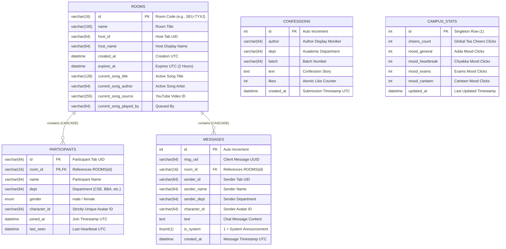

# Database Diagrams & Schema Visualizations

```mermaid
erDiagram
    ROOMS ||--o{ PARTICIPANTS : "contains (CASCADE)"
    ROOMS ||--o{ MESSAGES : "contains (CASCADE)"
    
    ROOMS {
        varchar(16) id PK "Room Code (e.g., SEU-TYXJ)"
        varchar(100) name "Room Title"
        varchar(64) host_id "Host Tab UID"
        varchar(64) host_name "Host Display Name"
        datetime created_at "Creation UTC"
        datetime expires_at "Expires UTC (2 Hours)"
        varchar(128) current_song_title "Active Song Title"
        varchar(64) current_song_author "Active Song Artist"
        varchar(255) current_song_source "YouTube Video ID"
        varchar(64) current_song_played_by "Queued By"
    }

    PARTICIPANTS {
        varchar(64) id PK "Participant Tab UID"
        varchar(16) room_id PK,FK "References ROOMS(id)"
        varchar(64) name "Participant Name"
        varchar(64) dept "Department (CSE, BBA, etc.)"
        enum gender "male / female"
        varchar(64) character_id "Strictly Unique Avatar ID"
        datetime joined_at "Join Timestamp UTC"
        datetime last_seen "Last Heartbeat UTC"
    }

    MESSAGES {
        int id PK "Auto Increment"
        varchar(64) msg_uid "Client Message UUID"
        varchar(16) room_id FK "References ROOMS(id)"
        varchar(64) sender_id "Sender Tab UID"
        varchar(64) sender_name "Sender Name"
        varchar(64) sender_dept "Sender Department"
        varchar(64) character_id "Sender Avatar ID"
        text text "Chat Message Content"
        tinyint(1) is_system "1 = System Announcement"
        datetime created_at "Message Timestamp UTC"
    }

    CONFESSIONS {
        int id PK "Auto Increment"
        varchar(64) author "Author Display Moniker"
        varchar(64) dept "Academic Department"
        varchar(64) batch "Batch Number"
        text text "Confession Story"
        int likes "Atomic Like Counter"
        datetime created_at "Submission Timestamp UTC"
    }

    CAMPUS_STATS {
        int id PK "Singleton Row (1)"
        int cheers_count "Global Tea Cheers Clicks"
        int mood_general "Adda Mood Clicks"
        int mood_heartbreak "Chyakka Mood Clicks"
        int mood_exams "Exams Mood Clicks"
        int mood_canteen "Canteen Mood Clicks"
        datetime updated_at "Last Updated Timestamp"
    }
```

