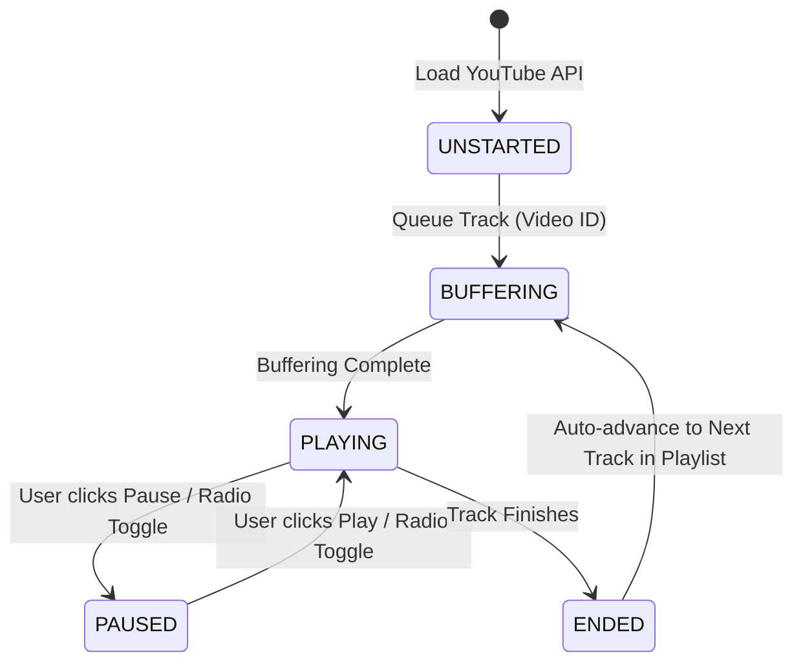
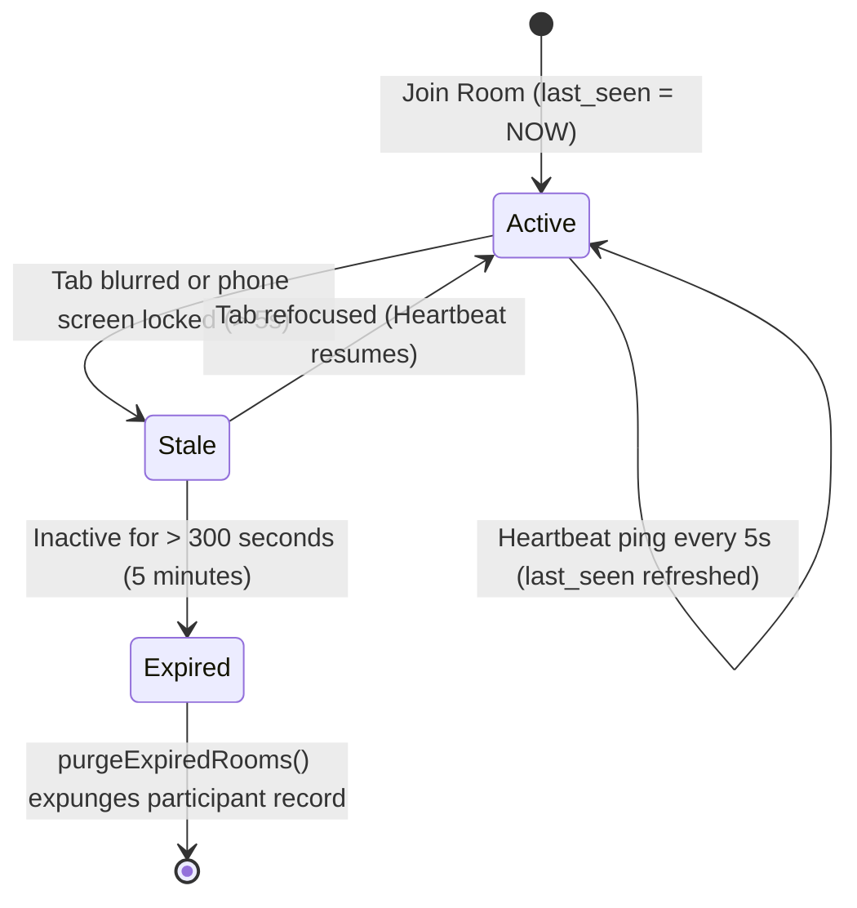

# Flowcharts, State Machines & Network Topologies

## 1. YouTube Player State Machine

```mermaid
stateDiagram-v2
    [*] --> UNSTARTED: Load YouTube API
    UNSTARTED --> BUFFERING: Queue Track (Video ID)
    BUFFERING --> PLAYING: Buffering Complete
    PLAYING --> PAUSED: User clicks Pause / Radio Toggle
    PAUSED --> PLAYING: User clicks Play / Radio Toggle
    PLAYING --> ENDED: Track Finishes
    ENDED --> BUFFERING: Auto-advance to Next Track in Playlist
```

## 2. Room Participant Inactivity State Machine

```mermaid
stateDiagram-v2
    [*] --> Active: Join Room (last_seen = NOW)
    Active --> Active: Heartbeat ping every 5s (last_seen refreshed)
    Active --> Stale: Tab blurred or phone screen locked (> 5s)
    Stale --> Active: Tab refocused (Heartbeat resumes)
    Stale --> Expired: Inactive for > 300 seconds (5 minutes)
    Expired --> [*]: purgeExpiredRooms() expunges participant record
```

