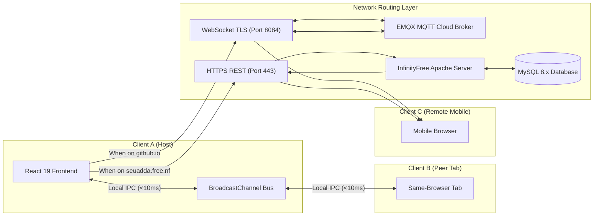

# Network Topology & Protocol Diagrams

```mermaid
flowchart LR
    subgraph ClientA["Client A (Host)"]
        UI_A["React 19 Frontend"]
        TabA["BroadcastChannel Bus"]
    end

    subgraph ClientB["Client B (Peer Tab)"]
        UI_B["Same-Browser Tab"]
    end

    subgraph ClientC["Client C (Remote Mobile)"]
        UI_C["Mobile Browser"]
    end

    subgraph CloudLayer["Network Routing Layer"]
        WSS["WebSocket TLS (Port 8084)"]
        HTTPS["HTTPS REST (Port 443)"]
        EMQXBroker["EMQX MQTT Cloud Broker"]
        InfinityFree["InfinityFree Apache Server"]
        MySQL[("MySQL 8.x Database")]
    end

    UI_A <-->|"Local IPC (<10ms)"| TabA
    TabA <-->|"Local IPC (<10ms)"| UI_B
    UI_A -->|"When on github.io"| WSS
    WSS <--> EMQXBroker
    EMQXBroker <--> WSS
    WSS --> UI_C

    UI_A -->|"When on seuadda.free.nf"| HTTPS
    HTTPS --> InfinityFree
    InfinityFree <--> MySQL
    InfinityFree --> HTTPS
    HTTPS --> UI_C
```

