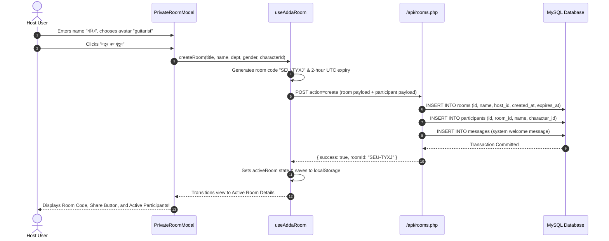
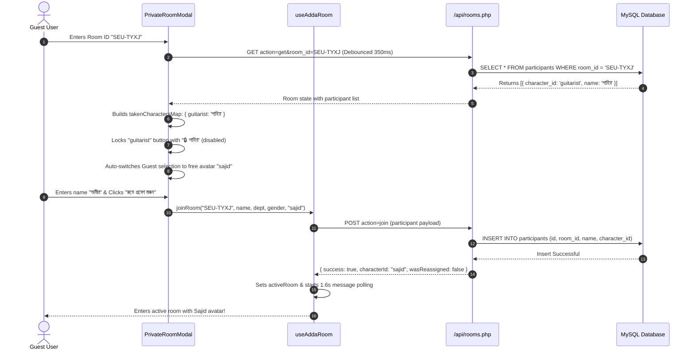

# System Sequence Diagrams Collection

## 1. Room Creation & Immediate Participant Registration

```mermaid
sequenceDiagram
    autonumber
    actor Host as Host User
    participant Modal as PrivateRoomModal
    participant Hook as useAddaRoom
    participant API as /api/rooms.php
    participant DB as MySQL Database

    Host->>Modal: Enters name "শাহির", chooses avatar "guitarist"
    Host->>Modal: Clicks "নতুন রুম খুলুন"
    Modal->>Hook: createRoom(title, name, dept, gender, characterId)
    Hook->>Hook: Generates room code "SEU-TYXJ" & 2-hour UTC expiry
    Hook->>API: POST action=create (room payload + participant payload)
    API->>DB: INSERT INTO rooms (id, name, host_id, created_at, expires_at)
    API->>DB: INSERT INTO participants (id, room_id, name, character_id)
    API->>DB: INSERT INTO messages (system welcome message)
    DB-->>API: Transaction Committed
    API-->>Hook: { success: true, roomId: "SEU-TYXJ" }
    Hook->>Hook: Sets activeRoom state & saves to localStorage
    Hook-->>Modal: Transitions view to Active Room Details
    Modal-->>Host: Displays Room Code, Share Button, and Active Participants!
```

---

## 2. Guest Join with Live Taken Character Lock

```mermaid
sequenceDiagram
    autonumber
    actor Guest as Guest User
    participant Modal as PrivateRoomModal
    participant Hook as useAddaRoom
    participant API as /api/rooms.php
    participant DB as MySQL Database

    Guest->>Modal: Enters Room ID "SEU-TYXJ"
    Modal->>API: GET action=get&room_id=SEU-TYXJ (Debounced 350ms)
    API->>DB: SELECT * FROM participants WHERE room_id = 'SEU-TYXJ'
    DB-->>API: Returns [{ character_id: 'guitarist', name: 'শাহির' }]
    API-->>Modal: Room state with participant list
    Modal->>Modal: Builds takenCharactersMap: { guitarist: 'শাহির' }
    Modal->>Modal: Locks "guitarist" button with "🔒 শাহির" (disabled)
    Modal->>Modal: Auto-switches Guest selection to free avatar "sajid"
    Guest->>Modal: Enters name "আবীর" & Clicks "রুমে প্রবেশ করুন"
    Modal->>Hook: joinRoom("SEU-TYXJ", name, dept, gender, "sajid")
    Hook->>API: POST action=join (participant payload)
    API->>DB: INSERT INTO participants (id, room_id, name, character_id)
    DB-->>API: Insert Successful
    API-->>Hook: { success: true, characterId: "sajid", wasReassigned: false }
    Hook->>Hook: Sets activeRoom & starts 1.6s message polling
    Hook-->>Guest: Enters active room with Sajid avatar!
```

